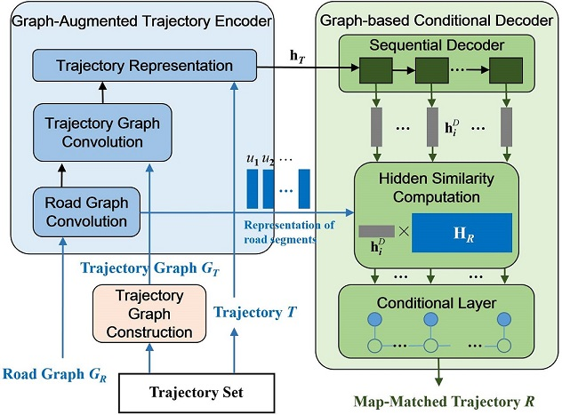

# GraphMM: Graph-based Vehicular Map Matching by Leveraging Trajectory and Road Correlations

This is a Python implementation of 

> GraphMM: Graph-based Vehicular Map Matching by Leveraging Trajectory and Road Correlations
>
> Yu Liu, Qian Ge, Wei Luo, Qiang Huang, Lei Zou, Haixu Wang, Xin Li, Chang Liu
>
> TKDE 2023 [PDF](https://ieeexplore.ieee.org/document/10158034)


## GraphMM Architecture

<p align="center"></p>


## Requirements

- `Python: 3.7.13`
- `Pytorch: 1.10.1`
- `PyG: 2.0.4`
- `networkx: 2.6.3`
- `nni: 2.9 # https://github.com/microsoft/nni`


## Run Examples

Data preprocess:
```
bash data_preprocess.sh
```

Training gmm with crf:

>modify the root_path in `config.py` to the absolute path where `road.txt` in

```shell
# way 1
python train_gmm.py --dev_id 0 --batch_size 32 --eval_bsize 32 --atten_flag --bi --use_crf --root_path {your data dir} --downsample_rate {your downsample_rate}

# way 2
# first modify your configuration and hyper-parameter search space, then run following command
nnictl create --config exp_local.yml -p {specified port, default 8080}
```

> The batch_size and eval_bsize can be setted based on your GPU memory size!

Training gmm without crf:

```shell
# way 1
python train_gmm.py --dev_id 0 --batch_size 256 --eval_bsize 256 --atten_flag --bi --root_path {your data dir} --downsample_rate {your downsample_rate}

# way 2
nnictl create --config exp_local.yml -p {specified port, default 8080}
```

Evaluate gmm with crf:

```shell
# First set the ckpt_path with your trained model, then run
python test.py --atten_flag --bi --use_crf --root_path {your data dir} --eval_bsize 32 --downsample_rate {your downsample_rate}
```

Evaluate gmm without crf:

```shell
python test.py --atten_flag --bi --root_path {your data dir} --eval_bsize 256 --downsample_rate {your downsample_rate}
```

The hyper parameters in `config.py` are tuned for Tencent dataset with 64K trajectories, and may not be suitable for other settings.


## Citations

If you find this repo useful and would like to cite it, citing our paper as following will be appropriate:

```
@ARTICLE{10158034,
  author={Liu, Yu and Ge, Qian and Luo, Wei and Huang, Qiang and Zou, Lei and Wang, Haixu and Li, Xin and Liu, Chang},
  journal={IEEE Transactions on Knowledge and Data Engineering}, 
  title={GraphMM: Graph-based Vehicular Map Matching by Leveraging Trajectory and Road Correlations}, 
  year={2023},
  volume={},
  number={},
  pages={1-14},
  doi={10.1109/TKDE.2023.3287739}
}
```


## Note

Our crf is modified based on [pytorch-crf](https://pytorch-crf.readthedocs.io/en/stable/).
